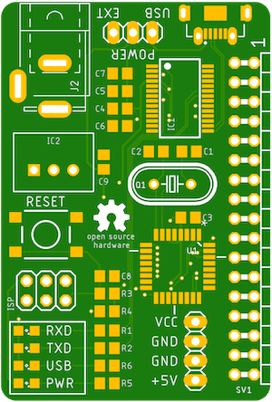

# Amiga USB Floppy Disk Reader

> __abandoned in favor of https://nickslabor.niteto.de/projekte/adf-copy/ __

This is a PCB I've designed to work with the marvelous idea, firmware and software 
from Rob Smith: https://github.com/RobSmithDev/ArduinoFloppyDiskReader 

It's nothing fancy but has some benefits I think that do matter:

* integrated _real_ FTDI232RL for communication and AVR flashing
* Decent DC/DC converter that can handle up to 5V/1A and wide input voltage (7-36V). 
This is the more power friendly way, as some drives demand more than the 
max. 500mA USB delivers
* Switchable to USB power if desired
* ATMega 328p on board with [Optiboot](https://github.com/Optiboot/optiboot)
* Solderpads for 4-pin Molex 3.5" connector with routed VCC. So if the drive needs 12V you 
can use a 12V power source

Of course this is only a fun project and does not aim to be the _best_ solution for Rob's 
approach, but it made my life easier.

This is the first release, as the PCB's have to be tested. I'm currently waiting for the 
prototypes.

## PCB

## Contributing

1. Fork it!
2. Create your feature branch: `git checkout -b my-new-feature`
3. Commit your changes: `git commit -am 'Add some feature'`
4. Push to the branch: `git push origin my-new-feature`
5. Submit a pull request :D

## Credits
Patrik Mayer, cod.m GmbH, 2019 

Rob Smith, who had the initial idea and wrote the software this is using

## License
[CC-BY-SA](https://creativecommons.org/licenses/by-sa/3.0/) 
